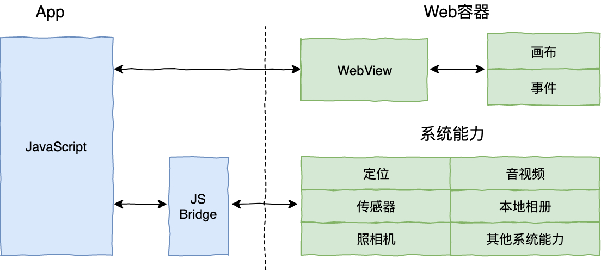
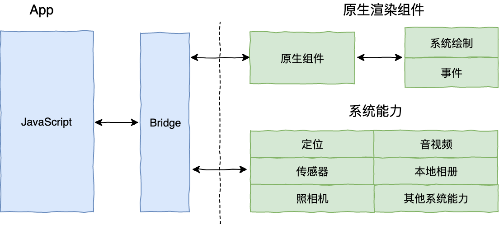
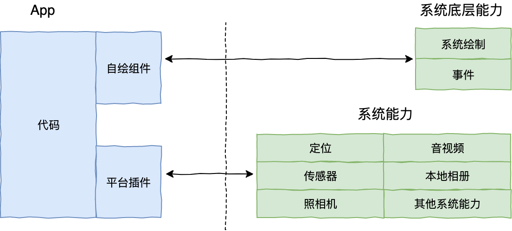
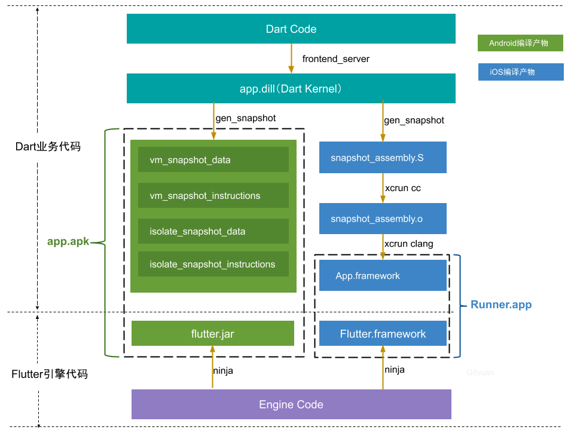
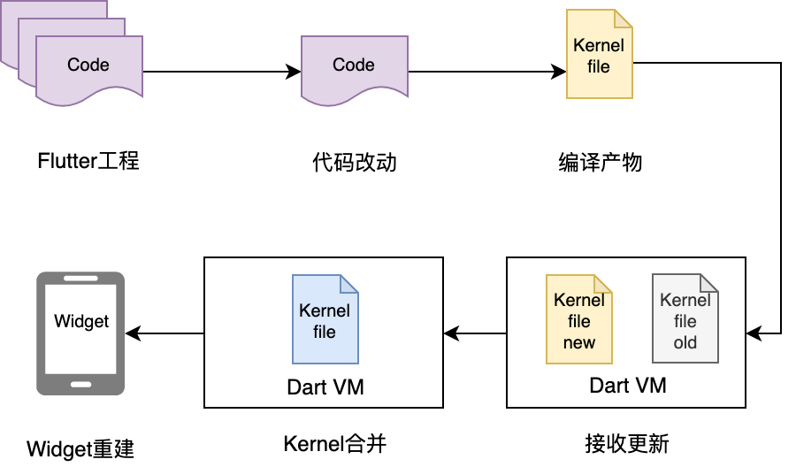
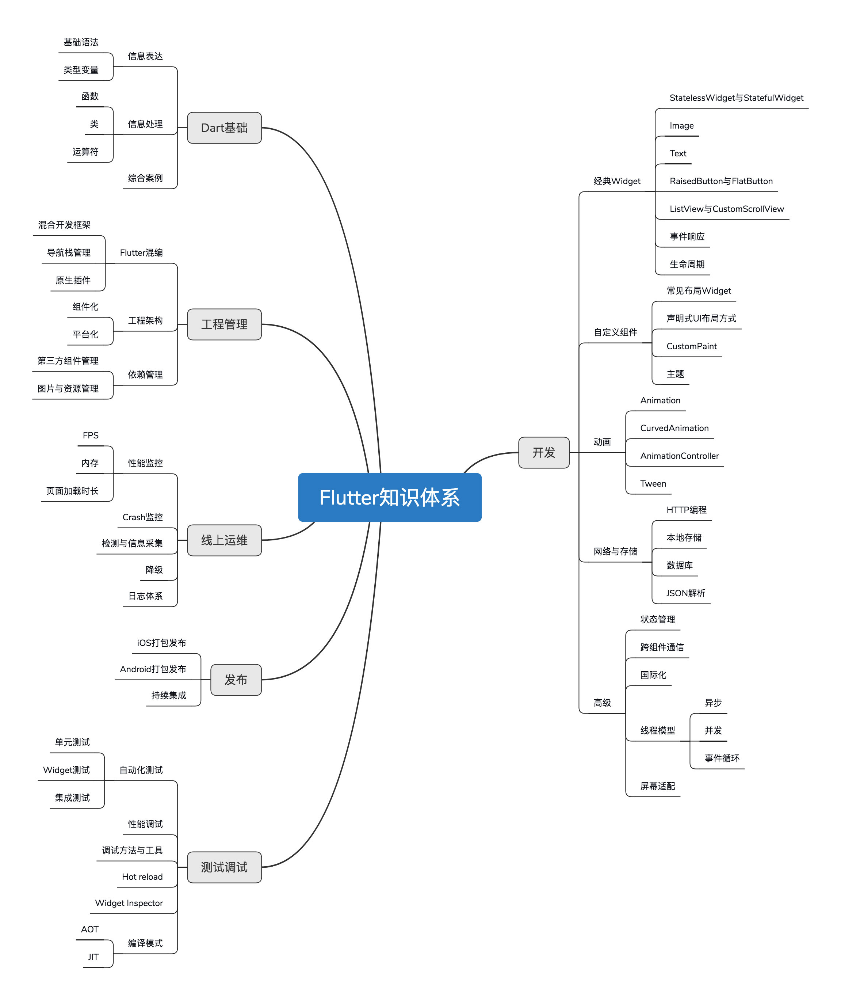

### 跨平台的优势

* 节省开发成本：跨平台开发可以同时适配多个平台，需要编写的代码量相对较少，因此可以节省开发成本。
* 提高开发效率：跨平台开发可以使用统一的开发工具和技术栈，减少了不同平台开发的学习成本，提高了开发效率。
* 更快的发布速度：跨平台开发可以同时发布到多个平台，可以更快地推出新功能和版本，提高了发布速度。
* 更好的用户体验：跨平台开发可以提供一致的用户体验，无论是在哪个平台上使用应用程序，用户都可以得到相同的功能和界面。
* 更好的维护性：跨平台开发可以使用统一的代码库，减少了代码维护的难度，可以更快地修复问题和更新应用程序。

总结，一份代码跑多个平台。

### 跨平台方案

#### web容器

基于 Web 相关技术通过浏览器组件来实现界面及功能

#### 泛web容器

采用类 Web 标准进行开发，但在运行时把绘制和渲染交由原生系统接管的技术，列如 React Native、Weex 和快应用

附赠一张ReactNative架构图

Yoga: C语言写的一个 CSS3/Flexbox 的跨平台 实现的Flexbox布局引擎。

RN口号：**learn once, write everywhere** 

#### 自绘引擎

自带渲染引擎，客户端仅提供一块画布即可获得从业务逻辑到功能呈现的多端高度一致的渲染体验。

附赠一张官网Flutter架构图

- Flutter 架构采用分层设计，从下到上分为三层，依次为：Embedder、Engine、Framework。
  - Embedder 是操作系统适配层，实现了渲染 Surface 设置，线程设置，以及平台插件等平台相关特性的适配。从这里我们可以看到，Flutter 平台相关特性并不多，这就使得从框架层面保持跨端一致性的成本相对较低。
  - Engine 层主要包含 Skia、Dart 和 Text，实现了 Flutter 的渲染引擎、文字排版、事件处理和 Dart 运行时等功能。Skia 和 Text 为上层接口提供了调用底层渲染和排版的能力，Dart 则为 Flutter 提供了运行时调用 Dart 和渲染引擎的能力。而 Engine 层的作用，则是将它们组合起来，从它们生成的数据中实现视图渲染。
  - Framework 层则是一个用 Dart 实现的 UI SDK，包含了动画、图形绘制和手势识别等功能。为了在绘制控件等固定样式的图形时提供更直观、更方便的接口，Flutter 还基于这些基础能力，根据 Material 和 Cupertino 两种视觉设计风格封装了一套 UI 组件库。我们在开发 Flutter 的时候，可以直接使用这些组件库。

flutter口号：**Build apps for any screen** 

### flutter跨平台性能好的两个原因

1. DartVM同时支持 JIT（Just-in-Time，即时编译）和 AOT（Ahead-of-Time，预编译），不仅保证了开发效率，更提升了执行效率。在代码执行效率可以媲美原生 App 的体验（即高性能）。而React Native 需要 JavaScript 执行引擎来解释执行源码，并通过桥接方式和 Native 环境进行通信，性能就远不及原生了。
2. Flutter 使用了最新版本的skia进行渲染，渲染性能基本可以和原生体验一致，而且视图渲染在 Android 和 iOS 上的高度一致性（即高保真）。不像RN会转成Native view进行渲染，导致双端效果不一致。且原生平台一直在更新，中间转化这层需要一直需要维护。在flutter3.3之后，iOS的渲染引擎更改为Impeller。可以支持metal进行渲染。android 的vulkan也在支持中，还未在正式版支持。

JIT和AOT是什么??? https://blog.csdn.net/h1130189083/article/details/78302502

skia是什么??? https://juejin.cn/post/7217750296171888699

metal 和vulkan 是什么???  https://www.cnblogs.com/taylorshi/p/15945916.html

#### 从编译产物看flutter了解

了解一下flutter的两个工具

* frontend_server: 进行词法分析、语法分析以及相关全局转换等工作，将dart代码转换为AST(抽象语法树)，并生成app.dill格式的dart kernel
* gen_snapshot: 经过CHA、内联等一系列执行流的优化，根据中间代码生成优化后的FlowGraph对象，再转换为具体相应系统架构（arm/arm64等）的二进制指令。

release构建：

Flutter产物分为Dart业务代码和Engine代码各自生成的产物，图中的Dart Code包含开发者编写的业务代码，Engine Code是引擎代码，如果并没有定制化引擎，则无需重新编译引擎代码。

一份Dart代码，可编译生成双端产物，实现跨平台的能力。经过编译工具处理后可生成双端产物，图中便是release模式的编译产物，Android产物是由vm、isolate各自的指令段和数据段以及flutter.jar组成的app.apk，iOS产物是由App.framework和Flutter.framework组成的Runner.app。

flutter编译过程及产物: https://segmentfault.com/a/1190000041790990

debug的hotReload流程。这整个服务跑在frontend_server中

* 代码改动：工具会扫描工程下的文件，通过修改时间来比对哪些文件被修改；
* 首次编译：第一次启动会生成全量app.dill文件；
* 增量编译：对修改的文件编译生成app.dill.incremental.dill增量文件；
* 更新文件：将增量产物推送到设备中；
* UI更新：DartVM收到增量文件后进行合并，并通知Flutter引擎更新UI

flutter热重载原理：https://emop.jd.com/blogs/2021/4/Interpretation%20of%20thermal%20overload%20principle%20in%20flutter.html

### fultter渲染机制

flutter一切皆Widget，但是实际执行绘制的对象，却是RenderObject。

Flutter UI有三大元素：**Widget、Element、RenderObject**

1. **Widget**：Widget是Flutter中的基本构建块，它是一个不可变的配置描述。Widget主要负责定义组件的配置、外观和功能。它们是UI的声明性描述。当应用程序的状态发生变化时，Flutter会根据新的Widget树重建UI。
2. **Element**：Element是Widget的实例化对象，它是Widget在运行时的具体表示。每个Widget会创建一个对应的Element。Element的主要作用是将Widget与底层渲染树连接起来。它还负责管理子元素和父元素之间的关系、生命周期管理以及有状态Widget的状态。Element树是Widget树的一个镜像。
3. **RenderObject**：RenderObject是实际执行绘制操作的对象，它负责布局和绘制。RenderObject树是Element树的一个子集，只有那些需要布局和绘制的Element才会创建对应的RenderObject。RenderObject负责计算其大小、位置、以及处理绘制操作。

对应到android原生，widget和element就类似生成view对象的过程，renderObject就类似，view经过measure, layout, 最后draw在canvas上面进行操作。

为什么会需要有widget -> element -> renderobject 不可以直接 widget -> renderobject？？？

`setState`实现局部更新的机制：

1. 当调用`setState`方法时，会向Flutter框架传递一个回调函数。在这个回调函数内部，你可以对组件的状态进行修改。
2. `setState`方法会将组件标记为"脏"（dirty），这意味着组件的状态发生了变化。
3. 在下一次绘制帧（frame）时，Flutter会检查所有被标记为"脏"的组件，并重新构建这些组件的UI。这个过程会触发组件的`build`方法，生成新的Widget树。
4. Flutter会比较新旧Widget树，并确定哪些部分发生了变化。然后，它会更新Element树和RenderObject树，以反映这些变化。
5. 最后，Flutter会重新绘制那些发生变化的RenderObject，从而实现局部更新。

所以在写UI时，尽可能小粒度的控制StatefulWidget的范围，避免没必要的widget的重建。

1. flutter的热更新
   * 目前只有一个开源方案。 mxflutter 用js去生成widget，然后用flutter引擎渲染。（动态DSL）{host}/articles/show/411688
   * 美团内部也有一个动态化的Flap但是没有开源。(静态DSL) https://tech.meituan.com/2020/06/23/meituan-flutter-flap.html
   * 公司内部有一个Conch。{host}/articles/show/552469
2. react native 0.7.0出了新的引擎Hermes，可以将js预编译成native code。不用解释执行js代码了。可以优化启动时间，减少内存占用以及空间占用。之前iOS是用系统自带的JavaScriptCore，android使用的是facebook编译的一个android平台的JavaScriptCore，所以android平台的rn包体积会更大。https://hermesengine.dev/

## 附赠：flutter的知识体系

