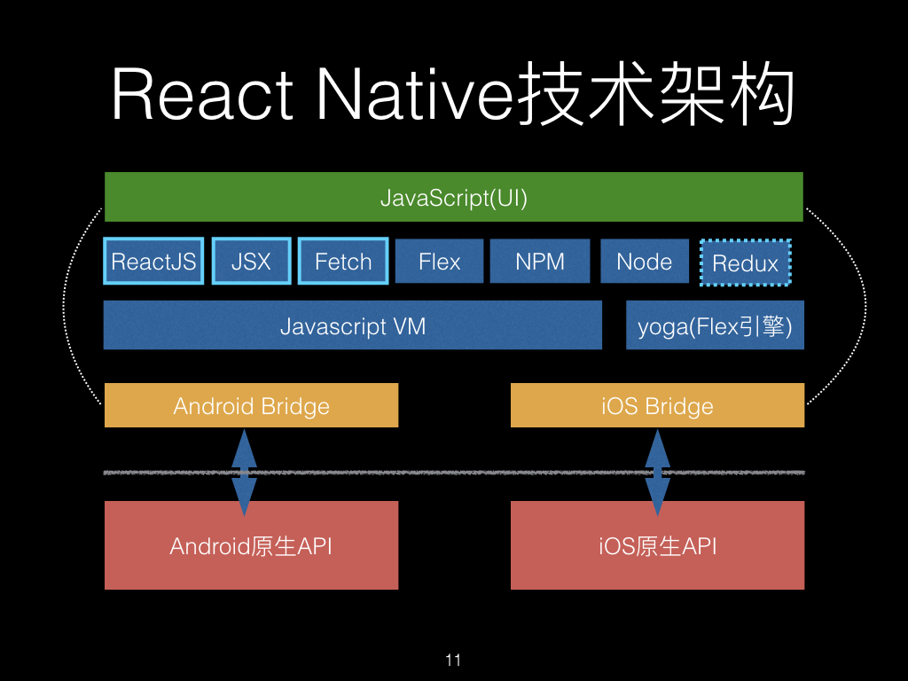

# flutter

### 跨平台方案

目前发展看有三个阶段

#### web容器

基于 Web 相关技术通过浏览器组件来实现界面及功能

#### 泛web容器

采用类 Web 标准进行开发，但在运行时把绘制和渲染交由原生系统接管的技术，列如 React Native、Weex 和快应用

附赠一张ReactNative架构图

Yoga: C语言写的一个 CSS3/Flexbox 的跨平台 实现的Flexbox布局引擎。

#### 自绘引擎

自带渲染引擎，客户端仅提供一块画布即可获得从业务逻辑到功能呈现的多端高度一致的渲染体验。

### flutter跨平台性能好的两个原因

1. DartVM同时支持 JIT（Just-in-Time，即时编译）和 AOT（Ahead-of-Time，预编译），不仅保证了开发效率，更提升了执行效率。在代码执行效率可以媲美原生 App 的体验（即高性能）。而React Native 需要 JavaScript 执行引擎来解释执行源码，并通过桥接方式和 Native 环境进行通信，性能就远不及原生了。
2. Flutter 使用了最新版本的skia进行渲染，渲染性能基本可以和原生体验一致，而且视图渲染在 Android 和 iOS 上的高度一致性（即高保真）。不像RN会转成Native view进行渲染，导致双端效果不一致。且原生平台一直在更新，中间转化这层需要一直需要维护。在flutter3.3之后，iOS的渲染引擎更改为Impeller。可以支持metal进行渲染。android 的vulkan也在支持中，还未在正式版支持。

JIT和AOT是什么??? https://blog.csdn.net/h1130189083/article/details/78302502

skia是什么??? https://juejin.cn/post/7217750296171888699

metal 和vulkan 是什么???  https://www.cnblogs.com/taylorshi/p/15945916.html

#### 从编译产物看flutter

了解一下flutter的两个工具

* frontend_server: 进行词法分析、语法分析以及相关全局转换等工作，将dart代码转换为AST(抽象语法树)，并生成app.dill格式的dart kernel
* gen_snapshot: 经过CHA、内联等一系列执行流的优化，根据中间代码生成优化后的FlowGraph对象，再转换为具体相应系统架构（arm/arm64等）的二进制指令。

release构建：

Flutter产物分为Dart业务代码和Engine代码各自生成的产物，图中的Dart Code包含开发者编写的业务代码，Engine Code是引擎代码，如果并没有定制化引擎，则无需重新编译引擎代码。

一份Dart代码，可编译生成双端产物，实现跨平台的能力。经过编译工具处理后可生成双端产物，图中便是release模式的编译产物，Android产物是由vm、isolate各自的指令段和数据段以及flutter.jar组成的app.apk，iOS产物是由App.framework和Flutter.framework组成的Runner.app。

flutter编译过程及产物: https://segmentfault.com/a/1190000041790990

debug的hotReload流程。这整个服务跑在frontend_server中

* 代码改动：工具会扫描工程下的文件，通过修改时间来比对哪些文件被修改；
* 首次编译：第一次启动会生成全量app.dill文件；
* 增量编译：对修改的文件编译生成app.dill.incremental.dill增量文件；
* 更新文件：将增量产物推送到设备中；
* UI更新：DartVM收到增量文件后进行合并，并通知Flutter引擎更新UI

flutter热重载原理：https://emop.jd.com/blogs/2021/4/Interpretation%20of%20thermal%20overload%20principle%20in%20flutter.html

### fultter渲染机制

flutter一切皆Widget，但是实际执行绘制的对象，却是RenderObject。

Flutter UI有三大元素：**Widget、Element、RenderObject**

1. **Widget**：Widget是Flutter中的基本构建块，它是一个不可变的配置描述。Widget主要负责定义组件的配置、外观和功能。它们是UI的声明性描述。当应用程序的状态发生变化时，Flutter会根据新的Widget树重建UI。
2. **Element**：Element是Widget的实例化对象，它是Widget在运行时的具体表示。每个Widget会创建一个对应的Element。Element的主要作用是将Widget与底层渲染树连接起来。它还负责管理子元素和父元素之间的关系、生命周期管理以及有状态Widget的状态。Element树是Widget树的一个镜像。
3. **RenderObject**：RenderObject是实际执行绘制操作的对象，它负责布局和绘制。RenderObject树是Element树的一个子集，只有那些需要布局和绘制的Element才会创建对应的RenderObject。RenderObject负责计算其大小、位置、以及处理绘制操作。

`setState`实现局部更新的机制：

1. 当调用`setState`方法时，会向Flutter框架传递一个回调函数。在这个回调函数内部，你可以对组件的状态进行修改。
2. `setState`方法会将组件标记为"脏"（dirty），这意味着组件的状态发生了变化。
3. 在下一次绘制帧（frame）时，Flutter会检查所有被标记为"脏"的组件，并重新构建这些组件的UI。这个过程会触发组件的`build`方法，生成新的Widget树。
4. Flutter会比较新旧Widget树，并确定哪些部分发生了变化。然后，它会更新Element树和RenderObject树，以反映这些变化。
5. 最后，Flutter会重新绘制那些发生变化的RenderObject，从而实现局部更新。

## 附赠：flutter的知识体系

